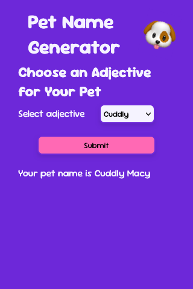

[# Pet Name Generator

## Description

The Pet Name Generator is a simple web application that allows users to generate a random pet name based on a selected adjective. This project was created to practice DOM manipulation and text content functions with template literals.

## Features

- Select an adjective for your pet from a dropdown menu.
- Generate a random pet name based on the selected adjective.
- Display the generated pet name on the screen.
- Responsive design with a mobile-friendly layout.
- Interactive buttons with hover effects.

## Technologies Used

- HTML
- CSS
- JavaScript

## Screenshot


## Installation

1. Clone the repository to your local machine:
    ```bash
    git clone https://github.com/your-username/pet-name-generator.git
    ```

2. Navigate to the project directory:
    ```bash
    cd pet-name-generator
    ```

3. Open the project in Visual Studio Code or your preferred code editor.

4. Install the Live Server extension in Visual Studio Code (if not already installed).

5. Right-click on the [index.html](http://_vscodecontentref_/0) file and select "Open with Live Server" to run the application.

## Usage

1. Open the application in your web browser.
2. Select an adjective for your pet from the dropdown menu.
3. Click the "Submit" button to generate a random pet name.
4. The generated pet name will be displayed on the screen.


